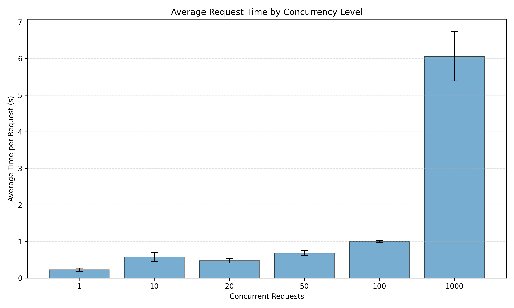
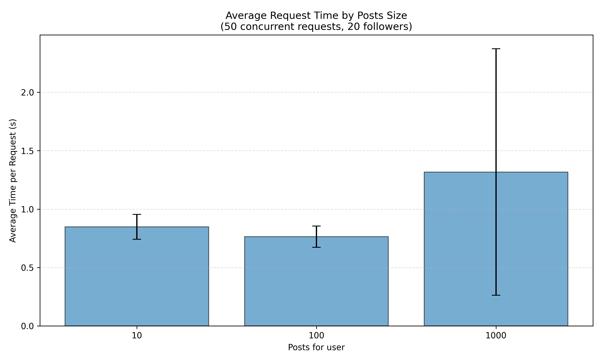
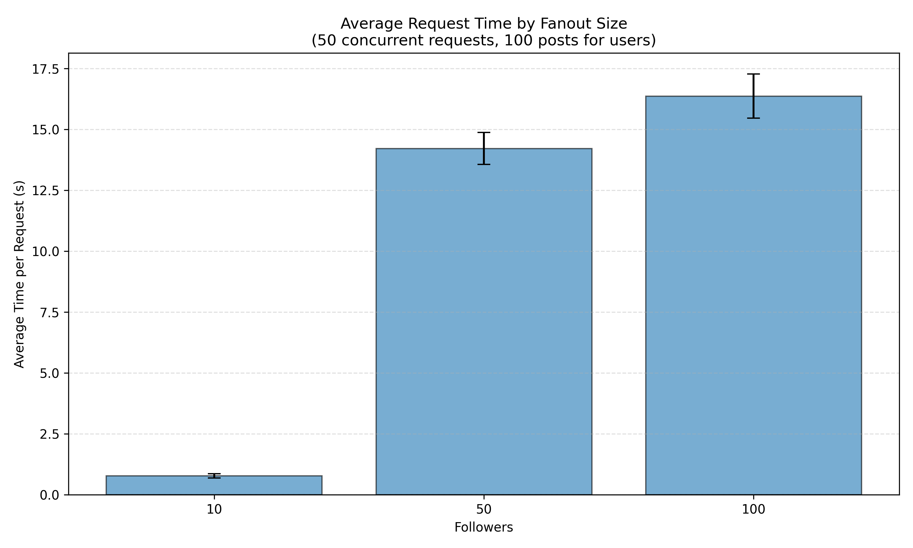

# Massive Data Project

Link of active server for ptoject [TinyInstagram](https://github.com/momo54/massive-gcp) : https://ue-donnees-massive-et-cloud.ey.r.appspot.com/

## How to start

* Set environment variable:
  ```bash
    export GOOGLE_APPLICATION_CREDENTIALS="../pathFileCredential.json"
  ```

* Populate database (we use seed.py file):
  ```bash
    python seed.py --users 1000 --posts 50 --follows-min 1 --follows-max 20
  ```
  
## Results

Below are the three barplot graphs generated during the benchmarking phase.  
Each plot shows the average execution time (in seconds) with error bars representing the variance from the three repeated runs.

### 1. Concurrency Experiment — `conc.png`

This graph shows the evolution of the average timeline request time depending on the number of **simultaneous users** (1, 10, 20, 50, 100, 1000).  
The dataset size is fixed to:
- 1000 users  
- 50 posts per user  
- 20 followers per user  

<p align="center">
  
</p>


### 2. Posts Scaling Experiment — `post.png`

This graph shows how performance changes when varying the **number of posts per user** (10, 100, 1000), while keeping:
- 50 concurrent requests  
- 20 followers per user  

<p align="center">
  
</p>


### 3. Fanout Scaling Experiment — `fanout.png`

This graph shows how performance evolves when varying the **number of followers (fanout)** per user (10, 50, 100), while fixing:
- 50 concurrent requests  
- 100 posts per user  

<p align="center">
  
</p>
